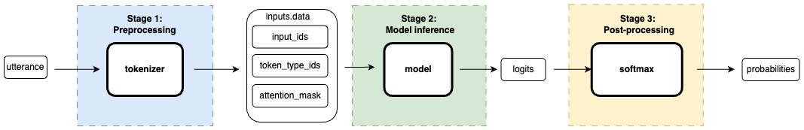

<!-- # Resources - tmp
- [lms_with_huggingface](https://github.com/roldanjrgl/lms_with_huggingface)
- [huggingface_deep_dive](https://github.com/roldanjrgl/huggingface_deep_dive/) 
- [sequence_classification.ipynb](https://github.com/roldanjrgl/huggingface_deep_dive/blob/main/sequence_classification.ipynb)
- [Huggingface's NLP-course](https://huggingface.co/learn/nlp-course/chapter1/1)
- [Transformer's pipeline](https://huggingface.co/learn/nlp-course/chapter2/2?fw=pt)
- [BERT's Hugginface's model doc](https://huggingface.co/docs/transformers/model_doc/bert) -->


# Introduction
Large Language models (LLMs) have revolutionized Natural Language Processing (NLP) and are still transforming the field and its applications as of 2025. These models excel at common NLP tasks such as summarization, question answering, and text generation. A common trend in state-of-the-art LLMs is that they base their architecture on the Transformer's architecture [^aiayn], and decoder-only models have gained favorability compared to encoder-only or encoder-decoder models [^yang_harness].


In this article, I will discuss how to use the BERT model [^bert] for a sequence classification task with the [Huggingface's `transformers` library](https://huggingface.co/docs/transformers). So, why should we still care we care about BERT in 2025? First, its historical significance as one of the first models to showcase the power of the Transformer architecture, and anyone working with LLMs should be familiar with it. Second, smaller, encoder-only models such as BERT are better suited for powerful interpretability and explainability techniques, including LIME [^lime], SHAP [^shap], and attention visualization using tools such as BERTViz [^bertviz_paper],[^bertviz_repo] , or exBERT [^exbert] . Third, BERT models excel at tasks such as sequence classification, i.e., intent classification or sentiment analysis, and name entity recognition, and for specific applications, it is a better option than modern LLMs. Fourth, BERT models are more cost-efficient, require fewer computing resources, are more environment-friendly, and can be more easily deployed for large-scale applications than LLMs. Finally, if you learn how to use BERT with the `transformers` library, you can apply the same skills to other state-of-the-art open-source LLMs. 

# Huggingface's transformers library
Huggingface's `transformers` is a wonderful open-source library to use pre-trained models for multiples tasks in modalities such as Natural Language Processing, Computer Vision, Audio, and Multimodel . One of its core advantages is its support, and interoperability between multiple frameworks such as PyTorch, TensorFlow, and JAX. [^transformers_doc] . You can find a list of the models supported here [Supported models and frameworks](https://huggingface.co/docs/transformers/index#supported-models-and-frameworks), and a comprehensive documentation for [BERT](https://huggingface.co/docs/transformers/model_doc/bert) [^bert_hf_docs]


## Model checkpoints and architectures {#model_checkpoints_and_architectures}
<!-- - [BERT's checkpoints](https://huggingface.co/models?other=bert) -->
<!-- - [Transformer's pipeline](https://huggingface.co/learn/nlp-course/chapter2/2?fw=pt) -->

Using BERT requires to choose an architecture, and a checkpoint. A checkpoint indicates the state of a pre-trained model such as its weights and configuration. These are some examples of widely-used BERT's checkpoints.


| Checkpoint (model-card)                                                                      | Notes                                         |
| -------------------------------------------------------------------------------------------- | --------------------------------------------- |
| [bert-base-uncased](https://huggingface.co/bert-base-uncased)                                | Trained on lowercased English text            |
| [bert-large-uncased](https://huggingface.co/bert-large-uncased)                              | Larger version of bert-base-uncased           |
| [bert-base-cased](https://huggingface.co/google-bert/bert-base-uncased)                      | Account for capitalization                    |
| [bert-large-cased](https://huggingface.co/bert-large-cased)                                  | Larger version of bert-base-case              |
| [bert-base-multilingual-uncased-sentiment](nlptown/bert-base-multilingual-uncased-sentiment) | Finetuned for sentiment analysis              |
| [bert-base-ner](https://huggingface.co/dslim/bert-base-NER)                                  | Fine-tuned for Named Entity Recognition (NER) |


The choice of architecture depends on the task that you are planning to do. These are some of the main architetures used with BERT.


| Task                    | Architecture                                                                                                                                   |
| ----------------------- | ---------------------------------------------------------------------------------------------------------------------------------------------- |
| Sequence Classification | [BertForSequenceClassification](https://huggingface.co/docs/transformers/v4.49.0/en/model_doc/bert#transformers.BertForSequenceClassification) |
| Token Classification    | [BertForTokenClassification](https://huggingface.co/docs/transformers/v4.49.0/en/model_doc/bert#transformers.BertForTokenClassification)       |
| Fill Mask               | [BertForMaskedLM](https://huggingface.co/docs/transformers/v4.49.0/en/model_doc/bert#transformers.BertForMaskedLM)                             |
| Question Answering      | [BertForQuestionAnswering](https://huggingface.co/docs/transformers/v4.49.0/en/model_doc/bert#transformers.BertForQuestionAnswering)           |
| Multiple choice         | [BertForMultipleChoice](https://huggingface.co/docs/transformers/v4.49.0/en/model_doc/bert#transformers.BertForMultipleChoice)                 |


# Using a pretrained BERT model for sequence classification
## Pipeline overview
<!--  -->



As shown in , the data illustrates...


## Complete source code {#complete_source_code}

To easily run this code, please check [sequence_classification.ipynb](https://github.com/roldanjorge/posts/blob/main/hf_bert_seq_class/sequence_classification.ipynb) or [sequence_classification.py](https://github.com/roldanjorge/posts/blob/main/hf_bert_seq_class/sequence_classification.py). If you want to run it on your machine, just install the [transformers](https://huggingface.co/docs/transformers/en/installation) and [torch](https://pytorch.org/get-started/locally/#linux-pip) packages.

For a detailed guide on how to install packages on a conda environment, please check this article: [Setting up a Conda environment](https://www.roldanjorge.com/posts/2025_02_22_setting_up_a_conda_environment/setting_up_a_conda_environment/).

<details>
  <summary>Show Code</summary>

```py
"""
This script demonstrates the pipeline for sequence classification using Huggingface transformers.
"""
import os
import torch
from transformers import AutoTokenizer, BertForSequenceClassification


def get_model_tokenizer(checkpoint: str, output_dir: str) -> (AutoTokenizer, BertForSequenceClassification):
    """ Download or load from local and return the model and its tokenizer

    Args:
        checkpoint: Huggingface checkpoint
        output_dir: Directory to store model and tokenizer file

    Returns:
        tokenizer: Tokenizer object
        model: Model object
    """
    if not os.path.exists(output_dir):
        print(f"Model directory {output_dir} does not exist. It will be downloaded from Huggingface")
        os.makedirs(output_dir)

        # Download model and tokenizer
        model = BertForSequenceClassification.from_pretrained(checkpoint)
        tokenizer = AutoTokenizer.from_pretrained(checkpoint)

        # Store model and tokenizer in output_dir
        model.save_pretrained(output_dir)
        tokenizer.save_pretrained(output_dir)
    else:
        print(f"Model {output_dir} stored locally. This local version will be uploaded")
        model = BertForSequenceClassification.from_pretrained(checkpoint)
        tokenizer = AutoTokenizer.from_pretrained(checkpoint)

    return tokenizer, model


def run_pipeline(utterance: str, tokenizer, model: BertForSequenceClassification):
    """ Run the pipeline for the sequence classification task
        Args:
            utterance: Input text
            tokenizer: Tokenizer object
            model: Model object
    """
    print(f"\n{50*'='}\nRunning pipeline: \"{utterance}\"\n{50*'='}")

    # Stage 1: Preprocessing
    print(f"{50*'-'}\nStage 1: Preprocessing \n{50*'-'}")
    inputs = tokenizer(utterance, return_tensors="pt")
    for _input, value in inputs.items():
        print(f"{_input:<15}: \n\t{value}")

    # Stage 2: Model inference
    print(f"\n{50*'-'}\nStage 2: Model inference \n{50*'-'}")
    with torch.no_grad():
        logits = model(**inputs).logits
    print(f"logits: \n\t{logits}")

    # Stage 3: Post-processing
    print(f"\n{50*'-'}\nStage 3: Preprocessing \n{50*'-'}")
    predictions = torch.nn.functional.softmax(logits, dim=-1)
    print(f"probabilities: \n\t{predictions}")
    print(f"id2label: \n\t{model.config.id2label}")
    print(f"predictions:")
    for _id, label in model.config.id2label.items():
        print(f"\t{label:<7}:\t{round(float(predictions[0][_id]), 3)}")


def main():
    # Setup tokenizer and model
    checkpoint = "nlptown/bert-base-multilingual-uncased-sentiment"
    output_dir = 'hf_bert_seq_class/model'
    tokenizer, model = get_model_tokenizer(checkpoint=checkpoint, output_dir=output_dir)

    # Positive review
    run_pipeline(utterance="I really loved that movie", tokenizer=tokenizer, model=model)

    # Negative review
    run_pipeline(utterance="I hate very cold, and cloudy winter days", tokenizer=tokenizer, model=model)


if __name__ == "__main__":
    main()

```
</details>

## Instantiate model and tokenizer
Note: Complete source code is included here [complete code](#complete_source_code)


### Downloading and storing model and tokenizer
How do we download a Hugginface's model and its respective tokenizer? All we need is a checkpoint, and its respective architecture as mentioned in [here](#model_checkpoints_and_architectures). For this post, we will be using the checkpoint [nlptown/bert-base-multilingual-uncased-sentiment](), and the [BertForSequenceClassification](https://huggingface.co/docs/transformers/v4.49.0/en/model_doc/bert#transformers.BertForSequenceClassification) architecture. Keep in mind that we use the `AutoTokenizer` class to automatically download the correct tokenizer by just using the checkpoint.

```py
import os
import torch
from transformers import AutoTokenizer, BertForSequenceClassification

checkpoint = "nlptown/bert-base-multilingual-uncased-sentiment"
output_dir = 'model'

# Download model and tokenizer
model = BertForSequenceClassification.from_pretrained(checkpoint)
tokenizer = AutoTokenizer.from_pretrained(checkpoint)

# Store model and tokenizer in output_dir
model.save_pretrained(output_dir)
tokenizer.save_pretrained(output_dir)
```


## Stage 1: Tokenize input
Note: Complete source code is included here [complete code](#complete_source_code)
```py
print(f"\n{50*'='}\nRunning pipeline: \"{utterance}\"\n{50*'='}")

# Stage 1: Preprocessing
print(f"{50*'-'}\nStage 1: Preprocessing \n{50*'-'}")
inputs = tokenizer(utterance, return_tensors="pt")
for _input, value in inputs.items():
    print(f"{_input:<15}: \n\t{value}")
```

## Stage 2: Model inference
Note: Complete source code is included here [complete code](#complete_source_code)
```py
# Stage 2: Model inference
print(f"\n{50*'-'}\nStage 2: Model inference \n{50*'-'}")
with torch.no_grad():
    logits = model(**inputs).logits
print(f"logits: \n\t{logits}")
```

## Stage 3: Post process results
Note: Complete source code is included here [complete code](#complete_source_code)
```py
# Stage 3: Post-processing
print(f"\n{50*'-'}\nStage 3: Preprocessing \n{50*'-'}")
predictions = torch.nn.functional.softmax(logits, dim=-1)
print(f"probabilities: \n\t{predictions}")
print(f"id2label: \n\t{model.config.id2label}")
print(f"predictions:")
for _id, label in model.config.id2label.items():
    print(f"\t{label:<7}:\t{round(float(predictions[0][_id]), 3)}")
```

## Example 1: Positive review
### Output
```bash
==================================================
Running pipeline: "I really loved that movie"
==================================================
--------------------------------------------------
Stage 1: Preprocessing 
--------------------------------------------------
input_ids      : 
        tensor([[  101,   151, 25165, 46747, 10203, 13113,   102]])
token_type_ids : 
        tensor([[0, 0, 0, 0, 0, 0, 0]])
attention_mask : 
        tensor([[1, 1, 1, 1, 1, 1, 1]])

--------------------------------------------------
Stage 2: Model inference 
--------------------------------------------------
logits: 
        tensor([[-2.3669, -2.2634, -0.4449,  1.5619,  2.7230]])

--------------------------------------------------
Stage 3: Preprocessing 
--------------------------------------------------
probabilities: 
        tensor([[0.0045, 0.0050, 0.0308, 0.2289, 0.7309]])
id2label: 
        {0: '1 star', 1: '2 stars', 2: '3 stars', 3: '4 stars', 4: '5 stars'}
predictions:
        1 star :        0.005
        2 stars:        0.005
        3 stars:        0.031
        4 stars:        0.229
        5 stars:        0.731
```

## Example 2: Negative review
### Output
```
==================================================
Running pipeline: "I hate very cold, and cloudy winter days"
==================================================
--------------------------------------------------
Stage 1: Preprocessing 
--------------------------------------------------
input_ids      : 
        tensor([[  101,   151, 39487, 12495, 19443,   117, 10110, 28419, 10158, 14690,
         12889,   102]])
token_type_ids : 
        tensor([[0, 0, 0, 0, 0, 0, 0, 0, 0, 0, 0, 0]])
attention_mask : 
        tensor([[1, 1, 1, 1, 1, 1, 1, 1, 1, 1, 1, 1]])

--------------------------------------------------
Stage 2: Model inference 
--------------------------------------------------
logits: 
        tensor([[ 0.7603,  0.8743, -0.0698, -0.7666, -0.7647]])

--------------------------------------------------
Stage 3: Preprocessing 
--------------------------------------------------
probabilities: 
        tensor([[0.3343, 0.3746, 0.1457, 0.0726, 0.0727]])
id2label: 
        {0: '1 star', 1: '2 stars', 2: '3 stars', 3: '4 stars', 4: '5 stars'}
predictions:
        1 star :        0.334
        2 stars:        0.375
        3 stars:        0.146
        4 stars:        0.073
        5 stars:        0.073
```


# References
[^bert]: J. Devlin, M.-W. Chang, K. Lee, and K. Toutanova, “BERT: Pre-training of Deep Bidirectional Transformers for Language Understanding,” in Proceedings of the 2019 Conference of the North American Chapter of the Association for Computational Linguistics: Human Language Technologies, Volume 1 (Long and Short Papers), J. Burstein, C. Doran, and T. Solorio, Eds., Minneapolis, Minnesota: Association for Computational Linguistics, Jun. 2019, pp. 4171–4186. doi: 10.18653/v1/N19-1423.

[^aiayn]: A. Vaswani et al., “Attention Is All You Need,” Aug. 01, 2023, arXiv: arXiv:1706.03762. Accessed: Apr. 03, 2024. [Online]. Available: http://arxiv.org/abs/1706.03762


[^behind_the_pipeline]: “Behind the pipeline.” [Online]. Available: https://huggingface.co/learn/nlp-course/chapter2/2?fw=pt


[^yang_harness]: J. Yang et al., “Harnessing the Power of LLMs in Practice: A Survey on ChatGPT and Beyond,” Apr. 27, 2023, arXiv: arXiv:2304.13712. doi: 10.48550/arXiv.2304.13712.


[^lime]: M. T. Ribeiro, S. Singh, and C. Guestrin, “‘Why Should I Trust You?’: Explaining the Predictions of Any Classifier,” Aug. 09, 2016, arXiv: arXiv:1602.04938. doi: 10.48550/arXiv.1602.04938.

[^shap]: S. Lundberg and S.-I. Lee, “A Unified Approach to Interpreting Model Predictions,” Nov. 25, 2017, arXiv: arXiv:1705.07874. doi: 10.48550/arXiv.1705.07874.


[^bertviz_paper]: J. Vig, “A multiscale visualization of attention in the transformer model,” in Proceedings of the 57th annual meeting of the association for computational linguistics: System demonstrations, M. R. Costa-jussà and E. Alfonseca, Eds., Florence, Italy: Association for Computational Linguistics, Jul. 2019, pp. 37–42. doi: 10.18653/v1/P19-3007.

[^bertviz_repo]: J. Vig, jessevig/bertviz. (Mar. 02, 2025). Python. Accessed: Mar. 02, 2025. [Online]. Available: https://github.com/jessevig/bertviz


[^exbert]: B. Hoover, bhoov/exbert. (Mar. 02, 2025). Python. Accessed: Mar. 02, 2025. [Online]. Available: https://github.com/bhoov/exbert


[^transformers_doc]: “🤗 Transformers.” Accessed: Mar. 03, 2025. [Online]. Available: https://huggingface.co/docs/transformers/index


[^bert_hf_docs]: “BERT.” Accessed: Mar. 03, 2025. [Online]. Available: https://huggingface.co/docs/transformers/model_doc/bert
